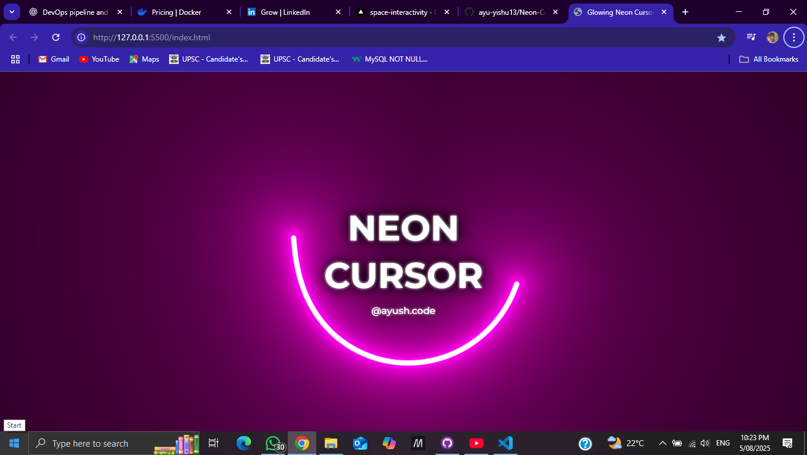

# ✨ Neon Cursor

A stylish and modern web project that adds a **neon glowing cursor trail effect** to your website. This project demonstrates how to enhance user interaction and aesthetics using HTML, CSS, and JavaScript.


## VERCEL
Live https://neon-cursor-six.vercel.app/
## 🔮 Features

- Neon glowing cursor trail
- Smooth and responsive animation
- Customizable color and effect radius
- Lightweight and pure front-end (no libraries)

## 🛠️ Technologies Used

- **HTML** – Page structure
- **CSS** – Styling and neon effects
- **JavaScript** – Cursor tracking and animation logic

## 📷 Screenshot



## 🚀 Getting Started

Clone or download this repository and open the HTML file in any modern browser.

```bash
git clone https://github.com/your-username/neon-cursor.git
cd neon-cursor
Open index.html in your browser to see the effect live.

📁 Project Structure
graphql
Copy
Edit
neon-cursor/
│
├── index.html       # Main HTML file
├── style.css        # CSS styles for neon cursor
├── script.js        # JavaScript for cursor movement
└── screenshot.png   # Project screenshot (optional)
📌 How it Works
Tracks mouse coordinates in real-time using JavaScript

Generates trailing elements that follow the cursor

Applies glow and fade animations with CSS for a neon effect

🎯 Use Cases
Portfolio websites

Interactive landing pages

Any site needing an engaging visual effect

🙌 Acknowledgements
This project was inspired by modern interactive UI design trends.

📃 License
This project is open-source and available under the MIT License.